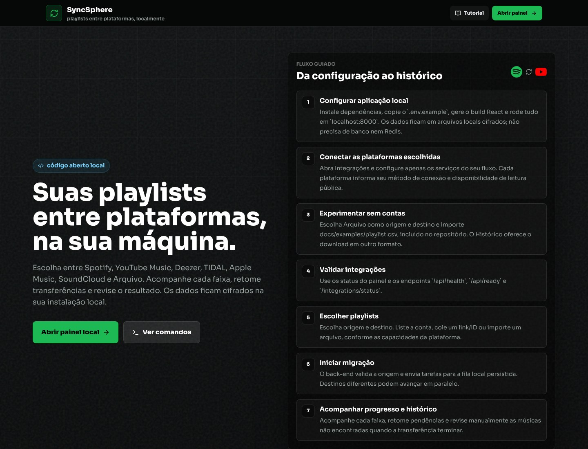

<div align="center">
  
  <h1>SyncSphere</h1>
  <p><strong>Your playlists across platforms, on your computer.</strong></p>
  <p>Spotify · YouTube Music · Deezer · TIDAL · Apple Music · SoundCloud · File</p>
  <p><a href="README.md">English</a> · <a href="README.pt-BR.md">Português (Brasil)</a></p>
  <p><a href="https://github.com/nicolassmotta/sync-sphere/actions/workflows/ci.yml"></a></p>
  <p><a href="#get-started">Get started</a> · <a href="docs/en/README.md">Documentation</a> · <a href="docs/en/contributing.md">Contribute</a> · <a href="LICENSE">MIT license</a></p>
</div>

SyncSphere transfers playlist references and metadata between music services and files. Choose a source and destination, follow progress, and review tracks that need a manual match. It does not download audio files.

Run it on your own computer. Credentials, history and the queue stay in encrypted local storage. There are no SyncSphere accounts, databases or Redis services to set up. The interface is available in **English and Brazilian Portuguese**. Choose the language in the header; your preference is saved in your browser.



*Screenshot from a demonstration installation using the Portuguese interface. File to File works without music accounts.*

> These guides follow the source branch. **Version 1.1.0 is in preparation and has not been published.** Check [Releases](https://github.com/nicolassmotta/sync-sphere/releases) for published versions. The detailed [1.1.0 notes](docs/releases/v1.1.0.md) are currently in Portuguese.

## Get started

Install Git and Node.js with npm. Use Node.js 22 or 24 LTS. The technical minimum is Node.js 20, which is outside its official support period; see the [Node.js release schedule](https://nodejs.org/en/about/previous-releases).

```bash
git clone https://github.com/nicolassmotta/sync-sphere.git
cd sync-sphere
npm run setup
npm run open
```

The launcher opens the dashboard in your browser. Choose **Try without accounts** to load a fictional playlist with three occurrences, including an intentional repeat. Review it, transfer from File to File, and download the output or CSV/JSON report from History. See [your first transfer](docs/en/first-transfer.md).

For music services, follow **Source > Destination > Connections > Playlists > Outcome**. Configure only the platforms you need. The panel can save Spotify and TIDAL Client IDs. The [installation guide](docs/en/getting-started.md) covers configuration, updates and stopping the app.

[Portable packages](docs/en/distribution.md) include Node.js. Extract the complete folder and open `Iniciar` for your system. They remain preparation artifacts, not a published release. Generating a package does not prove that it runs on that operating system.

## Platforms and connections

| Platform | Reading | Writing | Connection |
|---|---|---|---|
| Spotify | Connected account; links depend on API permissions | Connected account | Spotify app, Client ID and OAuth with PKCE |
| YouTube Music | Account cookie; YouTube Music or YouTube links | Account cookie | Full Cookie header pasted in the panel |
| Deezer | Public playlists without login; private/account playlists with cookie | Account cookie | `arl` for authenticated operations |
| TIDAL | OAuth; public reads with compatible app configuration | OAuth | TIDAL app and account authorization |
| Apple Music | Public catalog; authorized library | Authorized library | MusicKit or the alternative account token flow |
| SoundCloud | Public playlists without login; account playlists with token | Account token | `oauth_token` for authenticated operations |
| File | CSV, JSON, M3U/M3U8 and TXT | The same formats | No credentials |

See [integrations and privacy](docs/en/integrations.md). Some connections use unofficial website resources and may change without notice. Tests using simulated responses do not validate writes to real accounts. Real writes to the four additional providers remain pending validation.

## Recovery and limits

Reliable matches are cached locally for seven days. Retry preserves matches and reuses a known destination playlist. Providers compare occurrence counts before inserting missing tracks, preserving intentional repeats after partial writes. Recovery after remote creation but before saving its ID may still require manual review.

Temporary failures remain paused while a persisted retry is scheduled. Final failures and unmatched tracks can be reviewed in History. Confirmed source truncation is refused before creating the destination; split the source into smaller playlists. [Usage](docs/en/usage.md) lists reading limits and recovery behavior.

Essential unreadable data stops startup or readiness instead of becoming empty state. Preserve the original data and encryption key. **Help and security** offers [password-protected backups](docs/en/backups.md) and a diagnostic you can inspect before sharing. Nothing is submitted automatically.

## Contribute

Start with documentation, keyboard/mobile testing, demonstration transfers, or running a portable package on your operating system. See [contribution instructions](docs/en/contributing.md) and [security reporting](docs/en/security.md). Keep examples fictional and never include cookies, tokens, private URLs or local data in issues.

The public starter guides are available in English and Portuguese. Detailed architecture, API references, release notes and maintenance documents remain in Portuguese, with their language identified in the documentation index.
