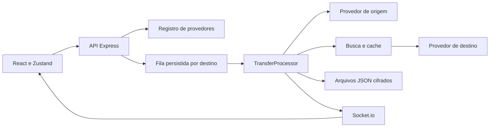

# Arquitetura

[Índice da documentação](README.md)

SyncSphere é uma aplicação para uma instalação local e uma pessoa. O Express entrega API e build React; Socket.io publica progresso; uma fila persistida no processo executa transferências. Credenciais e dados são armazenados em arquivos cifrados.

## Fluxo principal

## Estrutura

| Caminho | Responsabilidade |
|---|---|
| `backend/src/server.js` | Ambiente, HTTP, Socket.io e trabalhador. |
| `backend/src/app.js` | Middlewares, rotas, frontend estático e erros. |
| `backend/src/providers/` | Um adaptador por plataforma e registro do contrato. |
| `backend/src/controllers/` | Entrada HTTP e delegação de casos de uso. |
| `backend/src/modules/integrations/` | Rotas genéricas, credenciais e OAuth. |
| `backend/src/services/transfer/` | Processamento, estado por faixa, métricas, revisão e retomada. |
| `backend/src/services/matching/` | Pontuação compartilhada e cache. |
| `backend/src/storage/` | Leitura, escrita atômica e credenciais cifradas. |
| `backend/src/models/` | Histórico e representação da conta local. |
| `frontend/src/components/` | Layout, abas, tutorial e primitivas de interface. |
| `frontend/src/hooks/` | Status, seleção, estimativa e progresso. |
| `frontend/src/services/api.js` | Cliente HTTP com `withCredentials`. |
| `frontend/src/constants/providers.js` | Aparência e textos de ajuda por provedor. |

O backend usa ESM, Express e Zod. O frontend usa React 18, Vite 6, React Router, Zustand, TailwindCSS, Framer Motion e Lucide.

## Contrato dos provedores

[registry.js](../backend/src/providers/registry.js) registra Spotify, YouTube Music, Deezer, TIDAL, Apple Music, SoundCloud e Arquivo. Cada adaptador informa:

- Identidade, apelidos, autenticação e capacidades.
- Status e verificações de leitura e escrita.
- Normalização idempotente de link/ID.
- Lista da conta, preview e snapshot de playlist, conforme capacidade.
- Cliente de busca e extração do identificador da correspondência.
- Cliente de destino para criar playlist, inserir e obter o link.

Controllers e processador trabalham com esse contrato. Integrações específicas ficam dentro do provedor ou do serviço usado por ele.

## Integridade do snapshot de origem

Snapshots informam `truncated` quando o limite interrompe a paginação ou corta itens efetivamente retornados. `omittedTracks` informa quantas ocorrências foram cortadas, ou `null` quando essa quantidade não pode ser determinada. `unavailableTracks`, quando identificável, separa itens indisponíveis ou não suportados de um corte por limite. Um total maior que as faixas migráveis, sozinho, não prova truncamento.

A transferência persiste `sourceTotalTracks`, `sourceTruncated`, `sourceOmittedTracks` e `sourceUnavailableTracks`. Snapshots truncados são recusados antes de persistir faixas, buscar correspondências ou criar o destino, com orientação para dividir a playlist. Total desconhecido permanece `null` quando o provedor não consegue determiná-lo. Prévia e snapshot têm limites distintos; `hasMore` da prévia não determina sozinho a recusa da migração.

## Fila e estado por faixa

A fila tem uma raia por destino. Cada raia processa um job por vez, enquanto destinos diferentes podem avançar em paralelo. Jobs, tentativas e horários de retomada são persistidos em `queue.json`.

O estado da transferência usa `pending`, `processing`, `paused`, `needs_auth`, `completed` ou `failed`. As fases de progresso são `queued`, `reading`, `matching`, `inserting` e `done`.

O retry de inserção preserva `matched`, ID, pontuação e revisão manual. `pendingInsertCount` informa ocorrências resolvidas ainda não confirmadas no destino. Jobs existentes e ações simultâneas impedem outro retry.

Cada faixa usa `pending`, `matched`, `not_found`, `retry_queued` ou `failed`, além de `inserted`. Os checkpoints permitem pular buscas já resolvidas ao retomar.

Erros de limite de requisições pausam o fluxo. Erros de credencial pedem reconexão. Falhas temporárias recebem até três tentativas de job. A fila persiste o backoff e o trabalhador publica `paused` com `pauseReason=retry_scheduled` e o mesmo `resumeAt` do job. `failed` é publicado somente para falha definitiva ou esgotamento. O socket continua inscrito durante a pausa. Falhas definitivas e resultados ausentes ficam disponíveis no Histórico.

## Correspondência e revisão

O cache usa uma chave derivada do destino, contexto do catálogo e metadados da gravação. Ele guarda apenas correspondências aceitas, com validade de sete dias e limite de 5.000 entradas. Acertos pulam busca e atraso, sem alterar a média de latência externa usada nas métricas. Um índice em memória é compartilhado por todas as raias do processo. A persistência cifrada e atômica ocorre a cada cem mudanças, após um segundo ou ao encerrar a etapa de busca. Uma interrupção pode perder até 99 atualizações desde o último checkpoint; a perda afeta somente esse cache descartável. Não há coordenação entre múltiplos processos escritores, que continuam fora do modelo suportado.

Na revisão manual, o servidor busca usando título e artista ajustados, sem forçar o ISRC da origem. A proposta é persistida com UUID e validade de dez minutos. Confirmar marca a faixa como `matched` com origem `manual` e reenfileira a inserção. O serviço rejeita propostas expiradas e revisão concorrente com processamento.

## Inserção e retomada

O contrato `addTracks({ playlistId, ids, expectedIds })` distingue:

- `ids`: ocorrências ainda pendentes de inserção.
- `expectedIds`: todas as ocorrências resolvidas da transferência, inclusive já inseridas.

O destino consulta os itens existentes e compara quantidades. Assim, duas ocorrências desejadas da mesma faixa são distintas de repetir a chamada após uma falha parcial. Arquivo reconstrói a lista esperada; destinos remotos acrescentam o que falta.

Uma criação remota pode terminar antes de seu ID ser persistido. Não existe uma transação distribuída entre arquivos locais e todas as APIs externas. Esse intervalo pode exigir conferência manual após uma interrupção.

## Persistência

| Arquivo em `DATA_DIR` | Conteúdo |
|---|---|
| `credentials.json` | Tokens Spotify. |
| `provider-credentials.json` | Credenciais dos demais provedores. |
| `transfers.json` | Histórico. |
| `queue.json` | Jobs persistidos. |
| `transfer-tracks-<id>.json` | Estado por faixa e propostas manuais. |
| `provider-stats.json` | Médias para ETA. |
| `match-cache.json` | Correspondências confiáveis. |
| `file-imports.json` / `file-exports.json` | Playlists importadas e exportadas. |
| `encryption.key` | Chave local gerada quando `ENCRYPTION_KEY` não é definida. |
| `oauth-state.secret` | Segredo local do estado OAuth quando `JWT_SECRET` não é definido. |

Os JSONs são cifrados com AES-256-GCM; o leitor preserva compatibilidade com dados antigos em AES-256-CBC. A escrita cria um temporário exclusivo com permissão `0600`, sincroniza seu conteúdo e renomeia no mesmo diretório.

Isso reduz o risco de truncamento durante uma falha de processo. Não substitui backup e não garante uma transação entre todos os arquivos. Somente arquivo inexistente usa o estado padrão. Falha de leitura, decifração ou interpretação de coleção essencial gera erro explícito e bloqueia gravação posterior pelo leitor. A mensagem orienta conferir `DATA_DIR`, `ENCRYPTION_KEY` e backup. Uma chave local inválida também interrompe a inicialização sem substituição. O servidor verifica os arquivos essenciais antes de iniciar HTTP/trabalhador; `/api/ready` repete a verificação e retorna 503 se detectar falha. Cache e estatísticas podem ser descartados e sua indisponibilidade não impede a transferência.

## Segurança e testes

Não há autenticação própria de HTTP ou Socket.io: o usuário local é implícito. CORS, Helmet, limites de requisições e validação ajudam o fluxo, mas não são uma barreira de login para exposição pública.

Os testes usam diretórios temporários isolados e respostas simuladas de plataformas. O CI executa testes, lint, build e verificação da aplicação empacotada. Veja [CONTRIBUTING.md](../CONTRIBUTING.md), [API](api.md) e [SECURITY.md](../SECURITY.md).

Evidências das correções de integridade e recuperação: [Validação local](validation-transfer-integrity.md).

## Fluxo guiado e suporte local

O Início organiza a migração em Origem, Destino, Conexões, Playlists e Resultado. A seleção do par e da etapa fica apenas na sessão do navegador, sem credenciais. A demonstração importa três ocorrências fictícias pelo servidor e usa o trabalhador real do destino Arquivo. A interface identifica escritas experimentais a partir de metadados do registro de provedores.

`/api/v1/system` reúne demonstração, configuração de Client IDs, diagnóstico por lista permitida e download de backup. Essas rotas aceitam somente conexões de loopback. Client IDs do painel ficam em `provider-settings.json`, uma coleção essencial cifrada, reaplicada no boot. Trocar o aplicativo exige conta desconectada e fila vazia.

Relatórios por transferência exportam apenas campos definidos do resultado, sem erros brutos ou credenciais. O CSV neutraliza células que poderiam iniciar fórmulas ao serem abertas em planilhas.

O servidor usa bloqueio exclusivo do diretório de dados e escuta em loopback por padrão. A restauração ocorre em um processo separado com o servidor fechado: o pacote cifrado por senha é validado antes de gravar, recifrado para a chave de destino e aplicado com diário de rollback cifrado. O boot recupera um diário de restauração interrompida antes de verificar as coleções. Cache e estatísticas permanecem fora do backup.

O empacotamento copia uma lista explícita de código e documentação, instala apenas dependências de produção e confere o runtime Node.js contra a soma SHA-256 oficial. Artefatos locais não são uma publicação de versão. Veja [distribuição](distribution.md), [backup](backups.md) e [conferência com pessoas](usability-testing.md).

Evidências da primeira experiência e dos pacotes: [Validação local](validation-first-experience.md).

## Português e inglês

A interface possui seletor PT/EN, com preferência salva no navegador e fallback em português. Catálogos locais em `shared/locales/` são compartilhados pela API e pelo React. A API negocia `Accept-Language`, preserva enums e metadados, e retorna `Content-Language` e `Vary`. Relatórios localizam mensagens próprias; nomes de músicas e playlists permanecem originais. A troca de idioma não cria jobs nem limpa seleções. Veja [idiomas](localization.md) e [guias em inglês](en/README.md).
