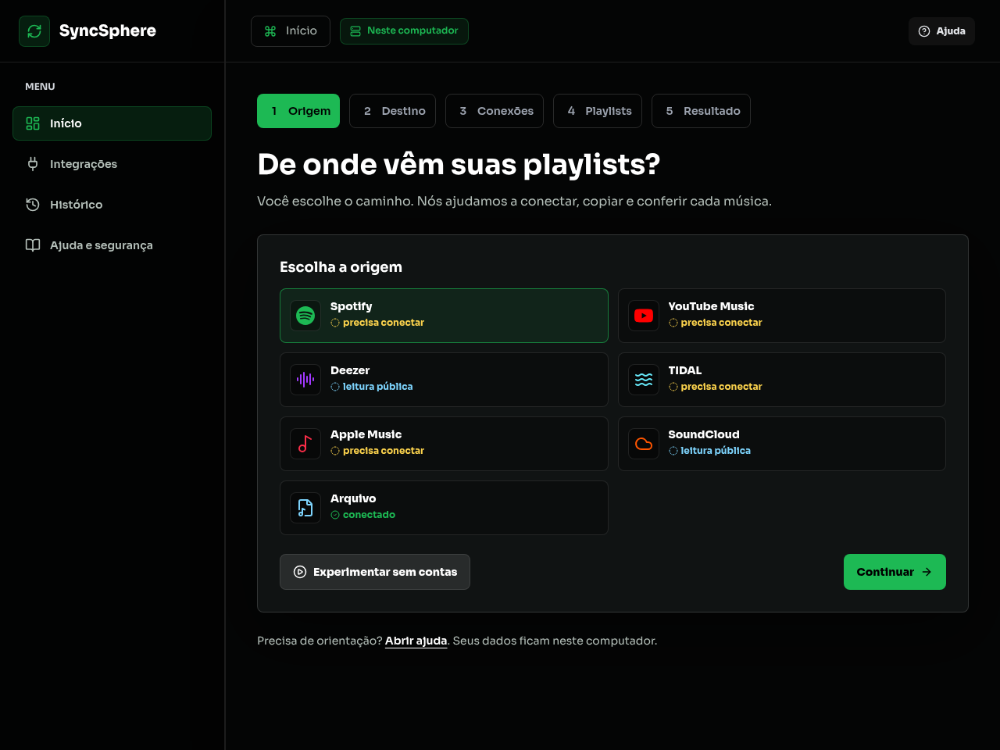
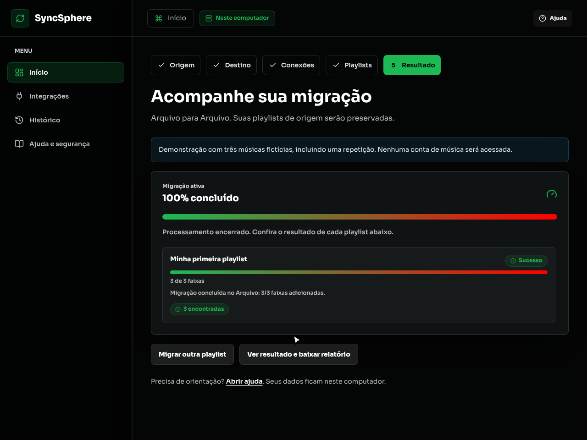

# Sua primeira migração

[Índice da documentação](README.md)

Você pode experimentar o SyncSphere sem conectar nenhuma conta de música. A demonstração usa três músicas fictícias, incluindo uma repetição, e cria um arquivo local de saída.

## Abrir o aplicativo

No pacote portátil, extraia a pasta inteira e abra **Iniciar**: `.cmd` no Windows, `.command` no macOS ou `.sh` no Linux. Mantenha a janela aberta durante o uso. Na instalação pelo código, execute `npm run setup` uma vez e depois `npm run open`.

O painel abre no navegador. Não há cadastro ou senha do SyncSphere. Seus dados ficam neste computador.

## Experimentar sem contas

*Instalação de demonstração, sem contas conectadas.*

1. Abra **Início** e escolha **Experimentar sem contas**.
2. O aplicativo seleciona Arquivo como origem e destino e importa **Minha primeira playlist**.
3. Confira as três ocorrências. A primeira música aparece duas vezes de propósito.
4. Clique em **Conferir e migrar**. Leia o resumo e confirme **Migrar 1 playlist**.
5. Acompanhe o resultado. Ao concluir, abra **Ver resultado e baixar relatório**.
6. No Histórico, abra **Ver detalhes**. Baixe a playlist no formato desejado e, se quiser, o relatório CSV ou JSON.

*Resultado real de Arquivo para Arquivo, com músicas fictícias.*

A demonstração não acessa uma conta externa. Os arquivos importados e exportados permanecem na instalação até você removê-los ou restaurar outro backup.

## Migrar entre serviços de música

O fluxo tem cinco etapas:

| Etapa | Sua ação |
|---|---|
| Origem | Escolha onde estão as playlists. |
| Destino | Escolha onde quer criar a saída. |
| Conexões | Conecte somente as plataformas escolhidas. Arquivo dispensa conexão. |
| Playlists | Marque playlists ou cole um link, conforme a plataforma. Confira e confirme. |
| Resultado | Acompanhe o progresso, pausas e músicas que precisam de revisão. |

As playlists de origem são preservadas. A correspondência depende do catálogo de destino: uma música pode ter outra versão ou não estar disponível. Confira o resultado antes de considerar a migração encerrada.

Spotify e TIDAL exigem um aplicativo criado por você no painel de desenvolvedores da plataforma. Copie o endereço de retorno mostrado no assistente, cadastre-o exatamente e salve o Client ID pelo painel do SyncSphere. Isso dispensa editar o `.env` para esse identificador.

Conexões por cookie ou token ainda exigem ferramentas do navegador. O assistente mostra uma instrução de cada vez e explica que esses valores dão acesso à sua conta. Nunca os envie em mensagens ou issues. Veja [Integrações](integrations.md) para instruções completas.

Escritas em Deezer, TIDAL, Apple Music e SoundCloud aparecem como **experimentais**, pois a confirmação com contas reais ainda está pendente. Integrações que usam recursos não oficiais do site podem mudar sem aviso.

## Se algo impedir a migração

- **Precisa conectar:** abra a conexão indicada e autorize a conta ou atualize a credencial.
- **Pausada:** confira o horário de retomada. Deixe o aplicativo aberto para a tentativa automática.
- **Não encontrada:** abra o Histórico e use **Escolher alternativa** para revisar a música.
- **Inserção pendente:** use o retry disponível. A correspondência e a playlist já criada são preservadas.
- **Limite de leitura:** divida a playlist em partes menores. Uma leitura cortada é recusada antes de criar o destino.

A aba **Ajuda e segurança** reúne orientação por sintoma, backup protegido e diagnóstico revisável. Nada é enviado automaticamente à comunidade.

## Demonstração em vídeo

Veja [a gravação da primeira migração](assets/primeira-migracao.webm). O vídeo usa dados fictícios e o fluxo Arquivo para Arquivo. A sequência numerada acima funciona como descrição textual do mesmo percurso.
