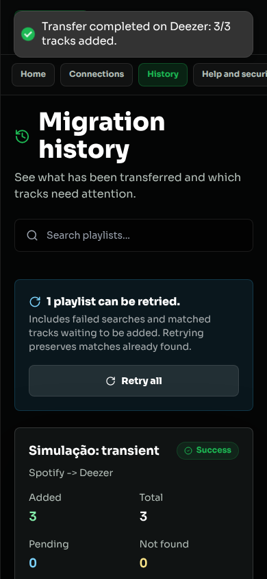
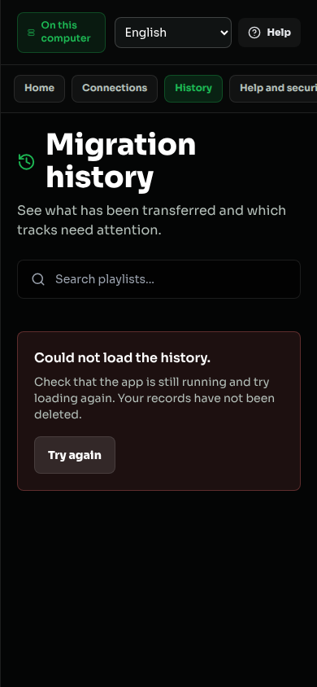
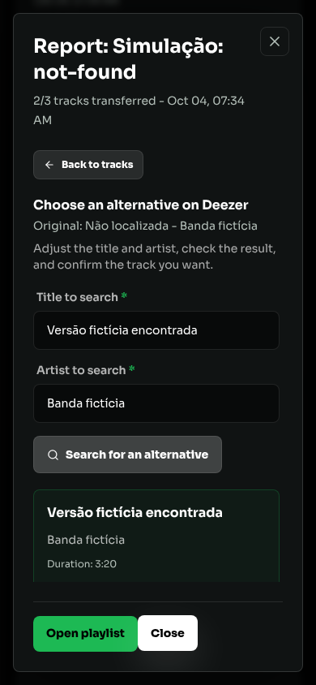
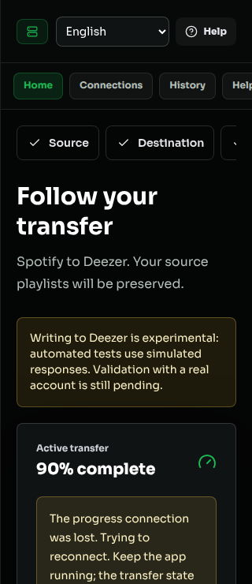

# Auditoria de rotas, recuperação e usabilidade

[Índice da documentação](README.md)

Execução concluída em 04/10/2026, na branch `fix/auditoria-fluxos-usabilidade`, sobre a entrega PT/EN. Node.js 24.15.0. A versão 1.1.0 continua em preparação.

## Escopo e critérios

A auditoria percorreu as 32 definições de rotas HTTP, expandiu cenários dos sete provedores, testou os 43 pares permitidos e verificou eventos Socket.io e ações visíveis no painel. Isso é uma matriz de cenários reproduzíveis, não uma garantia de que toda entrada ou falha possível foi simulada.

A revisão aplicou o contexto do projeto, testes orientados ao comportamento, critérios de design, acessibilidade e práticas React. Foram usados os [critérios públicos de interface da Vercel](https://raw.githubusercontent.com/vercel-labs/web-interface-guidelines/main/command.md). O visual escuro, a fonte local e a identidade existente foram preservados.

Toda persistência de teste usou diretórios temporários, chaves e credenciais fictícias. Nenhuma conta real de música foi acessada ou recebeu escrita. A instalação existente em backend/data não foi alterada.

## Matriz HTTP

Os cenários abaixo estão em `backend/tests/routes-audit.test.js`, `provider-http-errors.test.js`, `http-errors.test.js`, `http-limits.test.js` e nas suítes já existentes.

| Rotas | Comportamentos verificados |
|---|---|
| GET `/api/health`, `/api/ready` | Saúde, prontidão, armazenamento corrompido e formato incompatível. |
| GET `/api/v1/auth/me`; POST `/auth/logout` | Contrato do único usuário local, sem conta própria. |
| GET `/integrations/status` | Sete provedores, capacidades e ausência de credenciais na resposta. |
| GET `/integrations/:provider/login`, `/callback` | Métodos compatíveis, autorização negada, retorno local, state inválido e recuperação seletiva. |
| GET `/integrations/:provider/developer-token` | MusicKit configurado, ausência de configuração e provedor incompatível. |
| PUT `/integrations/:provider/credentials`; DELETE `/integrations/:provider` | Payload inválido, confirmação simulada, status e desconexão. |
| GET `/integrations/:provider/playlists` | Capacidades, lista e tratamento de erro. |
| GET `/integrations/:provider/playlists/:playlistId/tracks`, `/playlist-tracks` | Entrada ausente, prévia, hasMore e erros remotos 401/429/503/404. |
| POST `/integrations/file/imports`; DELETE `/file/imports/:importId`; GET `/file/exports/:exportId/download` | Importação, vazio, limite de tamanho, remoção, ausência e CSV/JSON/M3U/TXT. |
| GET/PUT `/system/providers/:providerId/setup` | Client ID válido/inválido, provedor permitido e configuração local. |
| GET `/system/diagnostic`; POST `/system/demo`, `/system/backups` | Diagnóstico seguro, demo, senha inválida e backup cifrado. |
| POST `/transfer/start` | Payload, pares, leitura antes da fila e classificação segura de falhas. |
| GET `/transfer`, `/transfer/:id`, `/transfer/estimate`, `/transfer/:id/tracks`, `/transfer/:id/report` | Histórico, propriedade, ausência, contagens, filtros, estimativa e relatórios. |
| POST `/transfer/retry-all`, `/transfer/:id/retry`, `/transfer/:id/resume` | Trabalho pendente, inserção, reinício anterior à leitura, concorrência e estados incompatíveis. |
| POST `/transfer/:id/tracks/:index/search`, `/confirm` | Consulta inválida, proposta, validade, confirmação e job existente. |

A cota geral, a de início e a de retomada foram exercitadas até 429. JSON malformado, conteúdo excessivo e CORS rejeitado também foram verificados. Os limites dos provedores não foram aumentados.

## Processamento e dados

`transfer-pairs-http.test.js` contém 77 cenários: 43 pares permitidos e 34 recuperações. HTTP, fila, processador, matching, checkpoints e relatórios usam código de produção; a fronteira dos provedores remotos é simulada.

- Todos os pares preservaram três ocorrências, incluindo a repetição intencional, e os metadados originais.
- 503 seguido de sucesso publicou pausa não terminal com resumeAt igual ao job persistido; a playlist foi reutilizada e não houve nova busca para faixas resolvidas.
- 503 persistente terminou depois das três tentativas; 400 terminou sem tentativa automática.
- 429 preservou a política própria; 401 aguardou reconexão e retomou pelo endpoint correspondente.
- Pontuações ausentes, não numéricas ou não finitas não autorizaram correspondência automática nem cache. Uma entrada antiga inválida permitiu buscar normalmente.
- JSON essencial de formato básico incompatível foi recusado nas oito coleções verificadas. A tentativa de gravação posterior falhou e os buffers dos arquivos permaneceram iguais.
- Socket.io real entregou snapshot persistido, permaneceu aberto durante pausa, não entregou metadados de outro registro e recusou identificador não textual.

## Conferência no navegador

As sessões próprias do agent-browser usaram o servidor normal em 8197 e a fixture em 8198, sempre com dados temporários. A fixture bloqueia fetch externo, substitui os adaptadores remotos e guarda o destino simulado em arquivo cifrado para permitir teste de reinício. As cotas são verificadas separadamente na suíte HTTP; a fixture as reinicia para permitir percorrer a matriz.

Foram conferidos apresentação, etapas de migração, seleção, prévia, confirmação, progresso, Histórico, relatórios, conexões, autorização OAuth simulada, revisão manual, ajuda e backup. Houve recarga, voltar do navegador, PT/EN, teclado, movimento reduzido e telas de 320, 390 e 1280 pixels.

Uma escrita parcial simulada terminou com uma playlist, duas tentativas e três ocorrências finais. expectedIds continha as três ocorrências nas duas tentativas. A revisão manual acrescentou somente a alternativa ausente ao destino já existente e manteve a repetição. O cenário truncado foi recusado sem destino; total original 5, carregadas 3 e omitidas 2 permaneceram registrados. Total desconhecido permaneceu null. Origem vazia e pontuação inválida tiveram falha explícita.

Ao encerrar o servidor simulado durante uma pausa, a tela informou reconexão e conservou o acompanhamento. Após iniciar novamente com o mesmo diretório temporário, o trabalho concluiu no destino persistido. Não foi declarada falha terminal por perda do transporte.

Na aplicação normal, Arquivo para Arquivo concluiu 3/3 ocorrências, preservou a repetição, entregou os quatro formatos com HTTP 200 e criou um backup cifrado. Esse fluxo local foi executado sem simular o provedor Arquivo.

## Correções resultantes

- Erros não devolvem corpo, consulta ou pilha; erros conhecidos mantêm orientação e erros remotos têm status adequado.
- State OAuth inválido retorna 400; reconectar uma plataforma não retoma trabalhos de outras; retry anterior à leitura informa reinício.
- Formatos essenciais incompatíveis e scores inválidos são recusados.
- Histórico e faixas indisponíveis têm erro recuperável, sem aparência de coleção vazia ou resultado resolvido.
- Cartões móveis mostram adicionadas, total, pendentes e não encontradas. Resultados incompletos orientam revisão; corte confirmado não oferece retry repetitivo.
- Abas possuem links e URL persistente; cabeçalho/navegação continuam acessíveis ao rolar.
- Client ID aceita Enter e preserva valor/foco no erro. Revisão não abre teclado móvel automaticamente. Campos obrigatórios não repetem asterisco para leitor de tela.
- Socket informa reconexão; progresso tem semântica e anima transform em vez de largura. Capas têm dimensões e fallback; comandos roláveis recebem foco e região nomeada.
- URLs executáveis não viram links de metadados. OAuth pode ser autorizado novamente sem remover a conexão anterior.

## Evidências e resultados

| Comando/verificação | Resultado |
|---|---|
| `npm test --prefix backend` | 437 testes em 34 suítes passaram. |
| `npm test --prefix frontend` | 22 testes de interação em cinco arquivos passaram. |
| `node --test --test-reporter=tap frontend/tests/i18n.test.mjs` | Seis testes de catálogos passaram. |
| `npm run lint`, `npm run build` | Passaram; API relativa usada no build da conferência. |
| `npm run dev --prefix backend` | Servidor normal em DATA_DIR temporário; saúde/prontidão HTTP 200. |
| `npm audit --omit=dev --json` nos dois projetos | Zero vulnerabilidades de produção. |
| `git diff --check` | Sem erros. |
| Pacote Linux x64 gerado e extraído | SHA-256, exclusão de dados/configuração/fixtures, runtime incluído, saúde, prontidão e demo passaram. |
| Benchmark do cache: 5.000 entradas e 1.000 acertos | 10,25 ms; timer atrasou 10,58 ms, Node.js 24.15.0. Observação desta máquina, sem limite de tempo em teste. |

Axe-core WCAG 2 A/AA não apontou violações na conferência final do Histórico móvel, conexões e ajuda. Apontamentos iniciais de contraste e região rolável/nomeada motivaram correções. Animações e elementos recortados exigiram aguardar estabilização ou inspeção visual; a verificação automatizada não substitui avaliação completa com leitor de tela.

## Limites

Simulações não comprovam autenticação, permissões, disponibilidade ou escrita nas contas reais. Escritas em Deezer, TIDAL, Apple Music e SoundCloud continuam pendentes de conferência com contas autorizadas. Windows/macOS, outras arquiteturas e sessões com pessoas leigas continuam pendentes. A auditoria não torna o servidor adequado para exposição pública sem controle de acesso externo.

As mudanças continuam em PRs para revisão. Não houve tag, Release ou declaração de que todos os cenários possíveis foram cobertos.
