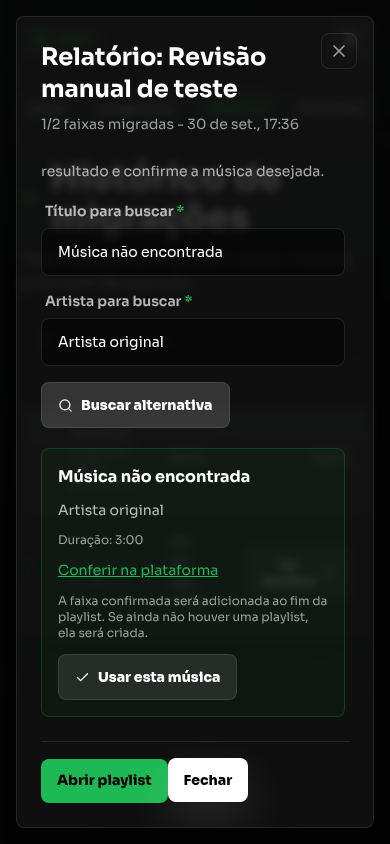

# Como usar

[Índice da documentação](README.md)

## Escolher origem e destino

No Início, escolha os dois provedores. O painel mostra se estão conectados ou disponíveis para leitura pública. Serviços que escrevem na conta precisam de autorização; Arquivo funciona sem credenciais.

A origem oferece, conforme suas capacidades:

- Lista de playlists da conta conectada.
- Link ou ID de uma playlist.
- Importação de CSV, JSON, M3U/M3U8 ou TXT.

Selecione as playlists, confira a estimativa e confirme a transferência. Pares com o mesmo provedor são recusados, exceto Arquivo -> Arquivo, que converte formatos.

## Acompanhar o processamento

O backend valida a leitura antes de enfileirar. Durante a execução, lê a origem, busca correspondências, cria o destino e insere faixas. O painel recebe progresso por Socket.io.

| Situação | O que fazer |
|---|---|
| Na fila | Aguarde a raia da plataforma de destino. |
| Em andamento | Acompanhe leitura, busca e inserção. |
| Pausada | Aguarde a retomada automática ou use a ação de retomar. |
| Aguardando reconexão | Atualize a credencial da plataforma em Integrações. |
| Concluída | Confira a saída e as faixas não encontradas. |
| Precisa de atenção | Leia o erro no Histórico e use retry ou revisão quando disponíveis. |

O tempo estimado usa medições anteriores de busca e inserção. Ele pode mudar durante a transferência, especialmente após bloqueios ou uso do cache.

## Retomar e tentar de novo

O estado de cada faixa e a fila ficam persistidos. Após reiniciar o servidor, trabalhos inacabados podem continuar. A leitura do destino e a comparação das quantidades evitam reenviar ocorrências já presentes em uma escrita parcial.

Falhas temporárias de leitura ou inserção ficam como **Pausada**, com horário de retomada automática. O painel continua acompanhando enquanto a fila tenta recuperar. Quando esgotadas, ficam em **Pendências** no Histórico. Use **Tentar de novo** para a playlist ou **Tentar todas** para pendências de várias playlists.

Faixas encontradas que ainda aguardam inserção também aparecem em **Pendências** e entram em **Tentar todas**. O retry conserva as correspondências e reutiliza a playlist já criada, inserindo apenas ocorrências ausentes. Não é permitido outro retry enquanto houver job para a transferência.

Essa ação não refaz automaticamente as faixas marcadas como não encontradas. Elas têm revisão manual própria.

Uma interrupção imediatamente após criar uma playlist remota, antes de persistir seu ID, pode exigir conferência manual para evitar criar outra playlist numa nova tentativa.

## Revisar uma música

1. Espere a transferência terminar.
2. Abra **Histórico > Ver detalhes**.
3. Em **Não encontradas**, use **Escolher alternativa**. A opção também pode aparecer para falhas definitivas.
4. Ajuste o título e o artista e clique em **Buscar alternativa**.
5. Confira o título, o artista e, quando disponível, o link da plataforma.
6. Use **Usar esta música** para confirmar.

O servidor guarda a proposta por dez minutos. Só essa proposta pode ser confirmada; a ação reenfileira a inserção. As faixas já inseridas são preservadas. Transferências em execução ou com job existente não aceitam revisão simultânea.

Registros antigos que não têm estado por faixa continuam visíveis, mas não oferecem revisão manual.

*Demonstração com resposta externa simulada e dados fictícios.*

## Arquivos exportados

Quando o destino for Arquivo, abra os detalhes no Histórico e escolha CSV, JSON, M3U ou TXT para baixar. Uma exportação pode ser baixada em qualquer desses formatos.

O arquivo contém as faixas resolvidas. Na conversão Arquivo -> Arquivo, os metadados são transportados sem busca externa. Veja [Formatos de arquivo](file-formats.md).

## Limites atuais

Estes valores descrevem a implementação atual do SyncSphere, não limites universais dos serviços:

| Operação | Limite |
|---|---|
| Importação de arquivo | Até 5 MB por requisição e 5.000 faixas. Arquivos maiores são recusados. |
| YouTube Music como origem | Até 1.000 faixas no snapshot usado pela transferência. |
| Deezer, TIDAL e Apple Music como origem | Até 2.000 faixas no snapshot de cada provedor. |
| SoundCloud | Até 500 faixas no snapshot e na lista enviada ao destino. Inserção acima disso é recusada. |
| Spotify, leitura pública alternativa | Até 1.000 faixas; o caminho autenticado depende da paginação e das permissões disponíveis. |
| Histórico na consulta padrão | Até 50 transferências mais recentes. |
| Cache de correspondências | 5.000 entradas com validade de sete dias. |

Quando o provedor confirma corte por limite, o SyncSphere recusa a transferência antes de criar o destino. O Histórico mostra o total original conhecido, quantas faixas foram lidas e as omissões conhecidas. Divida a playlist em partes menores e inicie novas transferências. Itens indisponíveis ou não suportados, quando identificáveis, são contabilizados separadamente e não provocam automaticamente essa recusa.

## Ordem, repetições e catálogo

A inserção inicial respeita a ordem das ocorrências resolvidas. Recuperações posteriores entram no fim das playlists remotas. Arquivo reconstrói a lista na ordem da origem.

Os adaptadores preservam repetições intencionais na solicitação e reconciliam quantidades antes de inserir. A aceitação final de cada faixa depende da API e do catálogo. Escritas reais nos quatro provedores adicionais continuam pendentes de validação com contas.

A busca compara título, artista e duração; ISRC é usado quando a origem o informa e o destino suporta esse método. Música ao vivo, remix, versão acústica e uploads de terceiros podem precisar de conferência manual.

## Erro ao abrir dados locais

Se a chave não corresponder aos dados ou um arquivo essencial estiver corrompido, o servidor interrompe a inicialização. Se a falha surgir durante a execução, `/api/ready` retorna 503 e operações sobre esses dados falham explicitamente. Os arquivos não são tratados como listas vazias.

Confira se `DATA_DIR` aponta para a instalação correta e se `ENCRYPTION_KEY` corresponde à chave original. Preserve os arquivos e restaure um backup compatível antes de retomar. Não gere outra chave para tentar abrir dados existentes. Cache e estatísticas são descartáveis; falhas nesses arquivos permitem continuar sem reutilizar suas informações.
