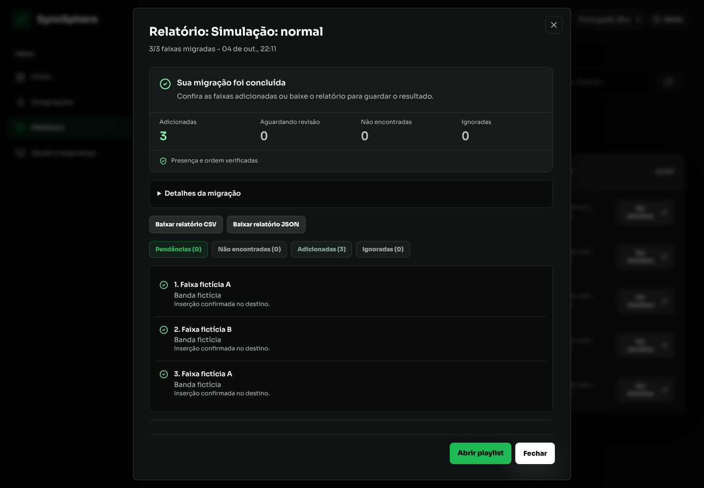
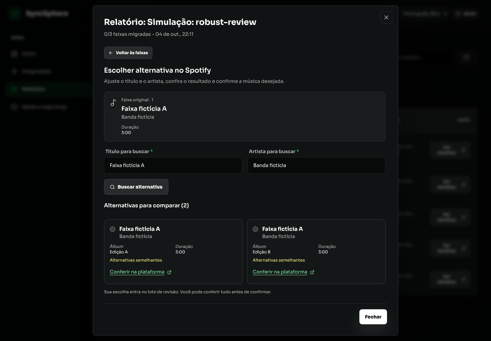

# Validação do Histórico e revisão de músicas

[Índice](README.md) · [Roadmap](roadmap.md)

Data: 04/10/2026. Execução local com armazenamento temporário e provedores simulados pela fixture `backend/tests/fixtures/browser-server.mjs`. Os dados e nomes das capturas são fictícios. Nenhuma operação em conta real foi realizada.

## Mudanças verificadas

- Filtros por atenção, andamento e conclusão combinados com busca por playlist, contagens e limpeza de filtros.
- Atualização do Histórico e do resultado em andamento sem fechar o relatório.
- Resumo com orientação, contagens e conferência do destino.
- Abertura na primeira categoria com faixas: pendências, não encontradas, adicionadas ou ignoradas.
- Comparação da faixa original com alternativas por título, artista, álbum, duração, conteúdo e motivos de revisão.
- Indicação visual da alternativa selecionada e ações disponíveis durante a rolagem da comparação.
- Resumo do lote com título, artista e álbum escolhidos; remoção de uma escolha antes da confirmação.
- Correções e preferências em seção expansível. Selecionar uma correção abre sua confirmação e mostra a alternativa escolhida.
- Confirmação de cópia ordenada bloqueada enquanto há pendências. Os metadados de apresentação ficam no navegador; a API recebe somente identificadores, ações e revisões.
- Exportações de arquivo e relatórios continuam acessíveis. Faixas adicionadas usam indicação de sucesso.

## Evidências

| Comando | Resultado |
| --- | --- |
| `rtk test npm test --prefix backend` | 38 suítes, 514 testes aprovados |
| `rtk test npm test --prefix frontend` | 5 arquivos, 31 testes aprovados |
| `rtk test npm run test:i18n --prefix frontend` | Zero falhas |
| `rtk err npm run lint --prefix frontend` | Zero erros |
| `rtk err npm run build --prefix frontend` | Build concluído |
| `rtk git diff --check` | Zero erros |

No navegador, a revisão recebeu duas escolhas, uma foi removida do resumo e somente a restante foi confirmada. O destino simulado recebeu uma ocorrência, mantendo as outras duas na revisão. O filtro de atenção e a busca sem resultados ofereceram orientação e limpeza. Português e inglês mantiveram os nomes originais das playlists e músicas.

Desktop conferido em 1440 × 1000. Em 390 × 844, o Histórico e a revisão não apresentaram transbordamento horizontal. A rolagem do diálogo permitiu comparar alternativas e alcançar as ações. `agent-browser errors` não retornou erros JavaScript.

`agent-browser a11y --tags wcag2a,wcag2aa` retornou zero violações e zero itens inconclusivos nas telas conferidas: Histórico, resultado concluído e revisão de alternativas. A comparação teve 27 verificações aprovadas; o resultado, 26; o Histórico, 25. Isso não substitui sessões de usabilidade com participantes reais.

## Capturas demonstrativas

As integrações reais, permissões de contas e qualidade de correspondência em catálogos reais continuam fora desta evidência.
