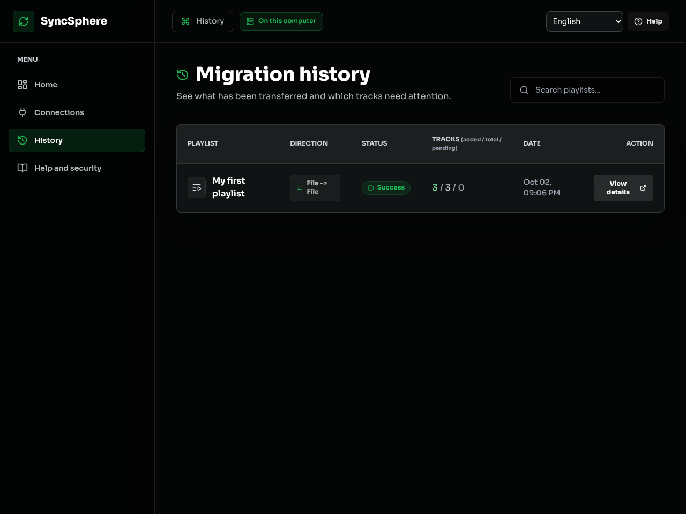
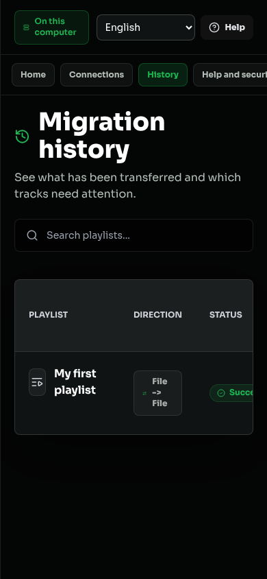

# Validação de português e inglês

Conferência realizada em 02/10/2026, na branch `feat/idiomas-portugues-ingles`, sobre a entrega de primeira experiência. Node.js local e runtime portátil: 24.15.0. A versão 1.1.0 continua em preparação.

## Escopo e isolamento

Interface, mensagens HTTP, progresso, relatórios, legendas e guias iniciais possuem versões PT/EN. Os 831 textos do catálogo têm paridade de chaves e parâmetros. Metadados da pessoa e enums técnicos não são traduzidos. Referências técnicas completas e prompts dos iniciadores permanecem em português, conforme [idiomas](localization.md).

Servidores de teste usaram portas 8137 e 8139, `DATA_DIR` temporário, caminho de ambiente inexistente e chave fictícia. A pasta de dados da instalação existente não foi alterada. Não houve acesso ou escrita em contas reais de plataformas.

## Comandos e resultados

| Verificação executada | Resultado observado |
|---|---|
| `npm test` | 246 testes em 26 suítes passaram. Inclui os cinco testes HTTP de idioma. |
| `npm test -- --runTestsByPath tests/i18n.test.js tests/system-support.test.js` | 18 testes passaram após a conferência dos relatórios e dados demonstrativos em inglês. |
| `npm run test:i18n --prefix frontend` | Seis testes passaram: catálogos, placeholders, preferência, troca nos dois sentidos, metadados, mensagens dinâmicas e limite de tamanho. |
| `npm run lint` | Sem erros ou avisos. |
| `npm run build` | Build concluído. Catálogos locais incluídos, sem requisição a serviço de tradução. |
| `npm run dev --prefix backend` | Inicialização em diretório temporário; `/api/health` e `/api/ready` responderam HTTP 200. |
| `npm audit --omit=dev --json --prefix backend` e equivalente do frontend | Zero vulnerabilidades nos dois. |
| `git diff --check` | Sem erros. |
| Conferência dos links locais e âncoras dos documentos alterados | Sem referências ausentes. |
| `npm run package -- --target linux-x64` | Pacote gerado localmente, sem tag ou Release. |
| Verificação do pacote extraído | Checksum, extração segura, catálogos, guias, iniciador, saúde, prontidão e demonstração em inglês passaram com o Node.js incluído. |

O CI existente também executa o teste dos catálogos. Resultados locais não são uma declaração de execução em Windows/macOS ou em contas reais.

## Navegador e comportamento

A conferência usou sessões próprias do `agent-browser` e dados fictícios. Foram observados:

- Inglês selecionado a partir do idioma do navegador, troca PT/EN pelo cabeçalho e preferência mantida após recarregar.
- Português como fallback com navegador em francês e armazenamento bloqueado. A troca para inglês funcionou na sessão sem erro de página.
- Seleção da playlist preservada após trocar de idioma, incluindo o resumo de confirmação.
- Demonstração Arquivo para Arquivo concluída com três ocorrências e a repetição preservada. CSV apresentou `Position, Track, Artist, Outcome, Match, Score`; JSON apresentou `added` sem mudar nomes/artistas.
- Troca de idioma durante inserção efetivamente em andamento: uma fixture temporária acrescentou oito segundos ao cliente Arquivo, sem mudar o código de produção. A tela permaneceu em 90%, com `Processing` passando para `Processando`, e concluiu em português com 3/3 adicionadas.
- Nessa troca, a quantidade de recursos de conexão Socket.io ficou em 12 antes e depois. Duas confirmações deliberadas de teste produziram duas transferências, sem transferência adicional na troca.
- Assistente de conexão em inglês, ajuda, formulário de backup e preservação dos valores digitados ao mudar o idioma. Nenhuma autorização de plataforma foi realizada.
- Histórico em 1280x960 e 390x844. Na tela pequena, a tabela e a navegação têm rolagem interna; a largura do documento permaneceu em 390 pixels.
- Axe-core com regras WCAG 2 A/AA: zero violações e zero verificações incompletas na conferência final do Histórico. O contraste dos cabeçalhos da tabela foi corrigido após um apontamento anterior. A conferência é automatizada e não substitui avaliação completa com tecnologias assistivas.

As capturas mostram dados fictícios de uma migração local efetivamente executada. Não representam uma escrita em conta real de serviço de música.

## Limites

Mensagens desconhecidas de terceiros permanecem no idioma original. Notificações que já estavam visíveis no instante da troca podem conservar o idioma em que foram emitidas; novas mensagens e o progresso usam a preferência atual. Os dados fictícios da demonstração são criados no idioma solicitado e, depois de importados, seguem a mesma preservação de metadados das demais playlists.

O vídeo foi gravado em português, com legendas nos dois idiomas. Os guias iniciais têm versões em inglês; arquitetura, API e referências detalhadas ainda estão em português. Somente Linux x64 foi executado nesta conferência do pacote. Escritas reais em provedores e validações com pessoas continuam pendentes. Não foi publicada nenhuma versão.
